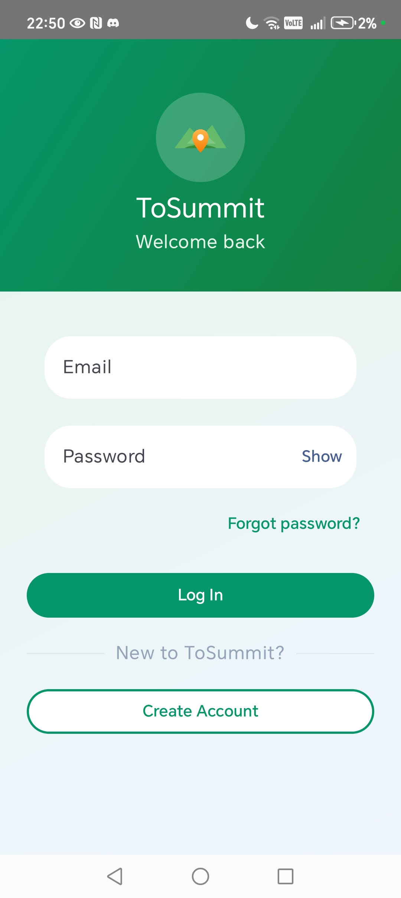
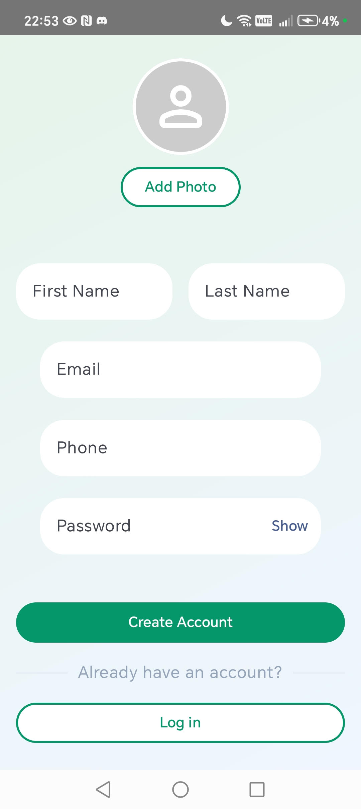
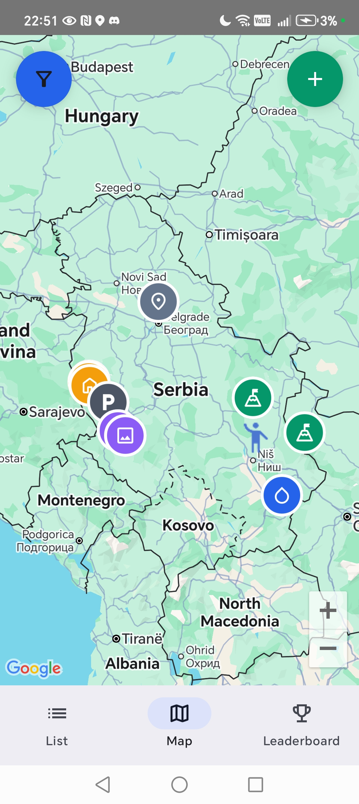
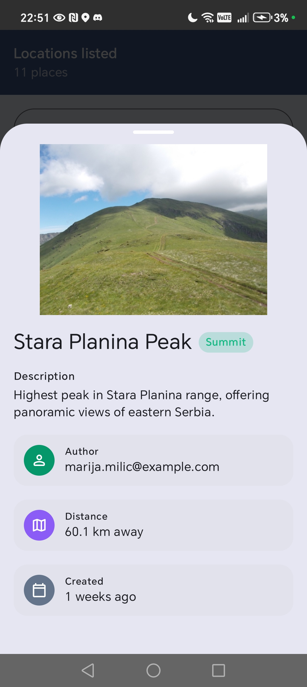
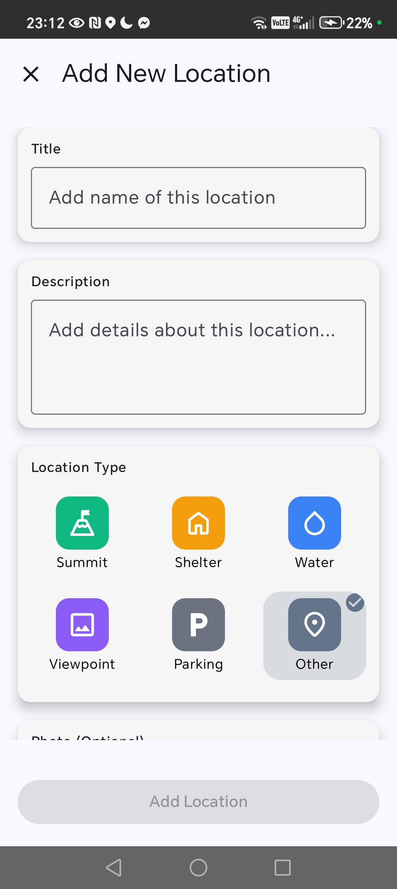
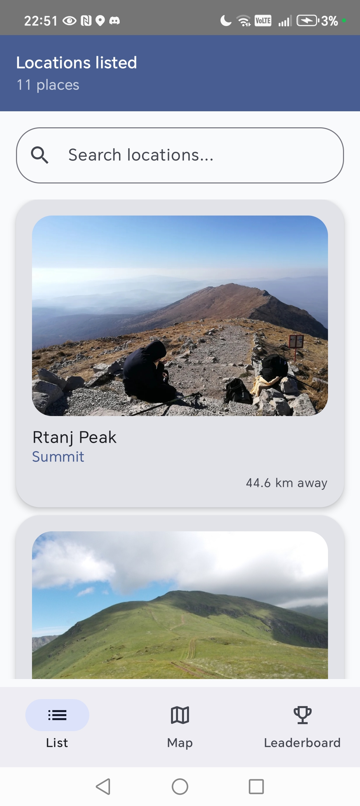
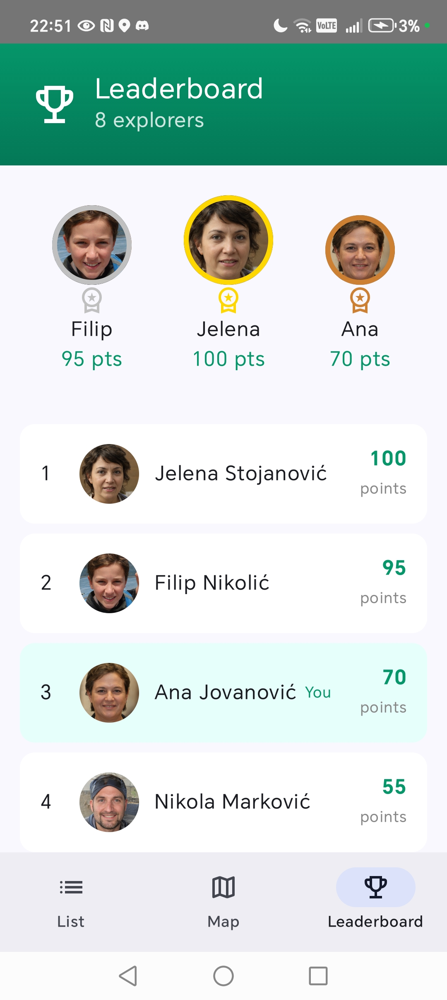

# ToSummit

**ToSummit** is a modern **Android application** built with **Kotlin** and **Jetpack Compose** that enables crowd-sourced discovery and mapping of outdoor locations such as mountain peaks, shelters, and water sources.

The app focuses on **real-time collaboration, location-based features, and clean UI architecture**, allowing users to contribute and explore verified trail data shared across the community.

---

## Screenshots

<table>
  <tr>
    <td></td>
    <td></td>
    <td></td>
    <td></td>
  </tr>
  <tr>
    <td align="center">Login</td>
    <td align="center">Register</td>
    <td align="center">Map</td>
    <td align="center">Details</td>
  </tr>
  <tr>
    <td></td>
    <td></td>
    <td></td>
    <td></td>
  </tr>
  <tr>
    <td align="center">Add</td>
    <td align="center">Filter</td>
    <td align="center">List</td>
    <td align="center">Leaderboard</td>
  </tr>
</table>

---

## Key Features

### Location-Based Exploration
- Interactive **Google Maps** integration
- Displays user’s **current location**
- Supports multiple outdoor location types:
  - Mountain summits
  - Water sources
  - Shelters
  - Viewpoints
  - Parking
  - Other points of interest
- Dynamic markers with type-specific icons

---

### Add New Locations
- Dedicated **Add Location** screen
- Users can:
  - Select a position on the map
  - Choose a location type
  - Add title and description
  - Upload a photo
- Each location is automatically linked to its author
- Data is stored in **Firebase Firestore** and synced in real time

---

### Location Details Bottom Sheet
- Material Design **Bottom Sheet** UI
- Opened from map markers or list items
- Displays:
  - Location title and type
  - Description
  - Distance from current user
  - Uploaded image
  - Author information
  - Creation timestamp

---

### Image Upload
- Image selection from device gallery
- Images uploaded and hosted via **Cloudinary**
- Displayed consistently across map and detail views

---

### User Authentication
- Registration and login using **Firebase Authentication**
- User profiles stored in Firestore, including:
  - Full name
  - Email
  - Phone number
  - Profile photo
  - Contribution points
- Contributions are automatically attributed to the logged-in user

---

### Crowd-Sourced Collaboration
- All user-submitted locations are shared in real time
- Enables collaborative and continuously growing trail data
- Designed with mobile crowd sensing principles

---

### Proximity Notifications
- Background distance calculation
- Users receive notifications when they are **within 100 meters** of a saved location

---

### Additional Screens
- **Locations List**
  - Sorted by distance from the user
- **Filter Screen**
  - Filter locations by type ,author and date posted
- **Leaderboard**
  - Ranks users based on contribution points

---

## Tech Stack

- **Language:** Kotlin  
- **UI:** Jetpack Compose (Material Design)  
- **Maps:** Google Maps SDK  
- **Backend:** Firebase  
  - Authentication  
  - Firestore (real-time updates)  
- **Media Hosting:** Cloudinary  

---

## Why This Project Matters

ToSummit demonstrates:
- Real-world use of **location services**
- Modern **Compose-based UI**
- Cloud-backed **real-time data synchronization**
- Clean separation of concerns and scalable app architecture
- Practical implementation of **community-driven data collection**

